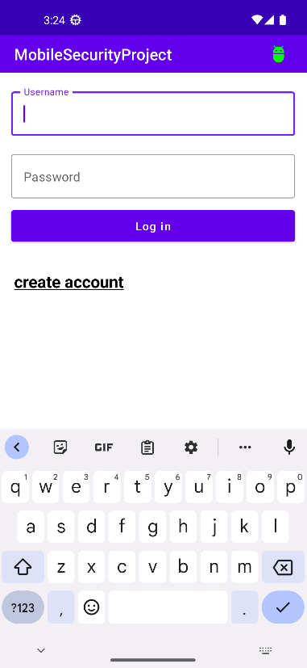
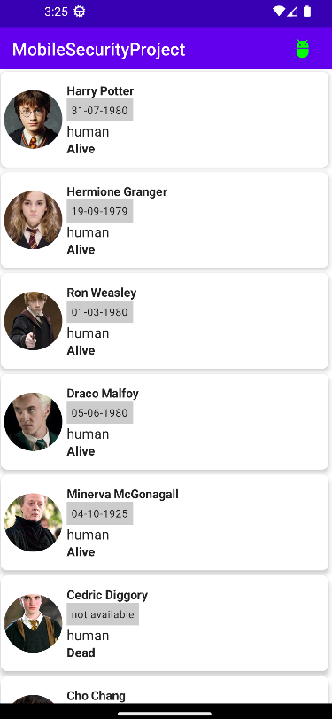

# Kotlin Basic Jetpack Compose App

This is a basic Android application built using Kotlin and Jetpack Compose framework. The app utilizes various libraries including Room for local database storage and Retrofit for API communication. The main features of the app include a login screen and a list of wizards displayed afterwards.
Features

    Login Screen: Users can enter their credentials to log into the app.

    Wizard List: Once logged in, the app displays a list of wizards.

    
    

## Libraries Used

The following libraries were used in the development of this app:

    Jetpack Compose: A modern toolkit for building native Android UI.

    Room: An abstraction layer over SQLite for database storage, providing an easy-to-use object-oriented API.

    Retrofit: A type-safe HTTP client for Android and Java, used for communicating with APIs.

## Requirements

To run this application, you will need:

    Android Studio 4.0 or above.
    Android SDK 23 or above.
    Kotlin version 1.5.10 or above.